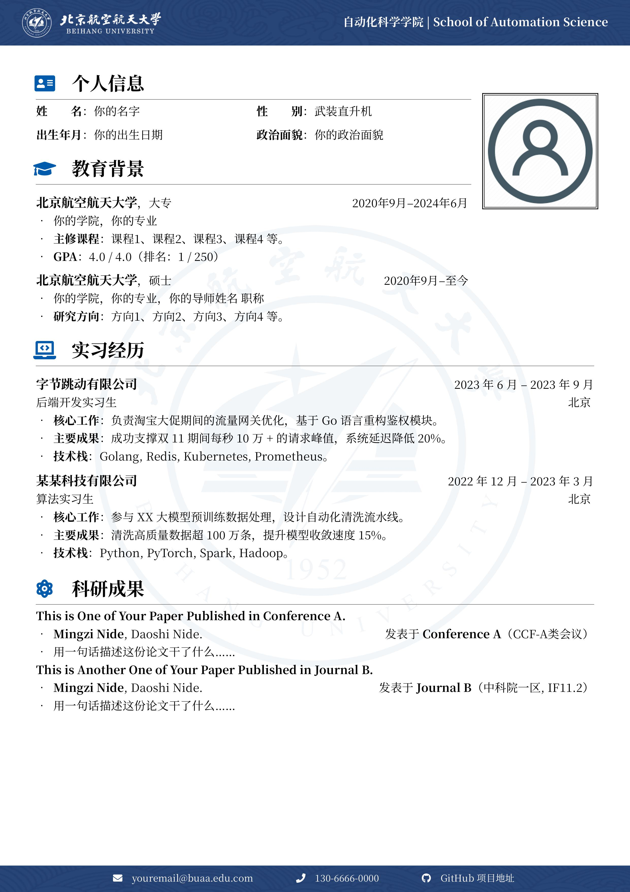
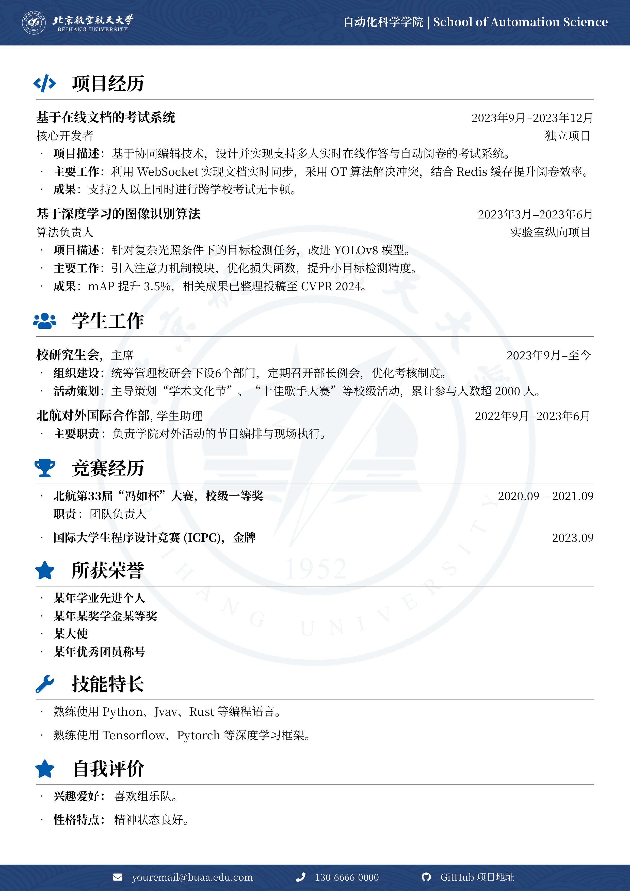
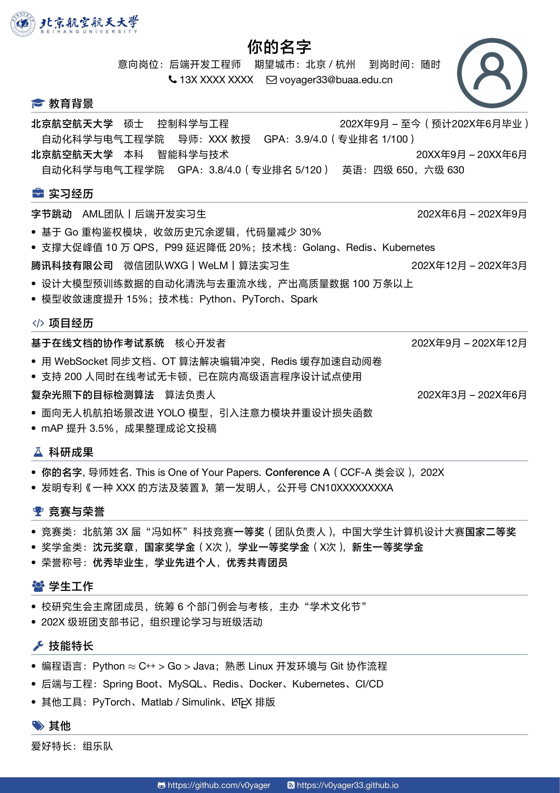

# 北京航空航天大学 LaTeX 中文简历模板

两套风格不同的北航简历模板，按需取用：

- **模板一（`Template-1/`）**：带校标组合页眉、页脚联系方式栏和校徽水印背景，信息容量大，适合保研 / 选调 / 科研岗等需要详细展开的场合，示例为两页。
- **模板二（`Template-2/`）**：单栏紧凑风格（排版参考 [WonderCV](https://www.wondercv.com/)），一页放完，信息密度高，适合互联网 / 技术岗投递。

## 预览

### 模板一

<div style="display: flex; justify-content: space-between;">
  
  
</div>

### 模板二



## 简介

基于:
- [SEU 中文 CV 模板](https://github.com/Exception0x0194/SEU-CV)
- [NPU 中文 CV 模板](https://www.overleaf.com/latex/templates/npu-cv)。

在原有内容的基础上进行了修改：

- 更改了校徽图标（参考 https://www.urongda.com/logos and https://xcb.buaa.edu.cn/info/1091/1481.htm）
- 调整了装饰图案的色彩风格
- 新增了单栏紧凑版模板（模板二），章节按北航学生的常见经历组织：教育背景、实习经历、项目经历、科研成果、竞赛与荣誉、学生工作、技能特长

## 使用方法

- 编辑对应目录下的 `main.tex`，对文档样式和内容进行修改。
- **模板一**：使用 `XeLaTeX` 或 `LuaLaTeX` 编译。
- **模板二**：只能使用 `XeLaTeX` 编译（用到了 `xeCJK`，pdfLaTeX / LuaLaTeX 会报错）。
- 两套模板的字体都随目录提供，无需在系统中安装；编译时的工作目录需为 `main.tex` 所在目录，否则相对路径的字体和图片会找不到。

## 目录结构

```
Template-1/
├── fonts/        思源宋体 NotoSerifSC（开源可商用），中英文共用
├── images/       校标组合、页眉页脚装饰、校徽水印、证件照
└── main.tex      图标使用 fontawesome5
Template-2/
├── Font/         Helvetica Neue LT Pro + 方正 ProGB18030（商业字体，注意版权）
├── fonts/        与 Font/ 内容相同的一份副本，未被引用，可删除
├── img/          BUAA.png（校名横版标识）、avatar.png（证件照）
└── main.tex      图标使用 fontawesome（v4）
docs/             readme 中使用的预览图
```

## 自定义提示

- **换颜色**：模板一改 `primary_color` / `secondary_color`，模板二改 `CVBlue`。北航蓝为 `RGB(0, 91, 172)`。
- **换字体**：给了 `Extension` 选项后，`BoldFont` 中不要再带 `.otf` 后缀，否则 fontspec 会去找 `xxx.otf.otf` 而报字体找不到。
- **不放证件照**：注释掉 `main.tex` 中定位照片的那段 `tikzpicture` 即可。
- **模板二加页**：在合适位置插入 `\newpage`；校徽和页脚栏默认只在第一页显示，需要每页都有就把对应的 `tikzpicture` 代码复制到新页开头。
